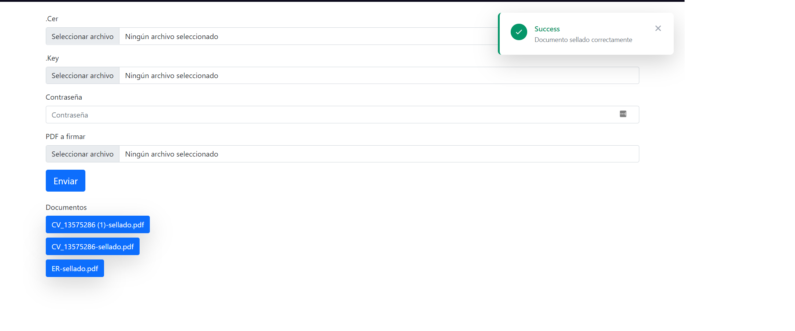

## Introduction

Laravel CSD document sealer

<p align="center">

</p>
<hr>

## Version Guidance

<table>
  <tbody>
    <tr>
      <td>Version</td>
      <th>Laravel Version</th>
      <th>Status</th>
      <th>Branch</th>
    </tr>
    <tr>
      <th>0.1</th>
      <td>>= 7.0</td>
      <td>Develop</td>
      <td>Main</td>
    </tr>
  </tbody>
</table>

## Description

:us: This project can seal any pdf document with CSD (FIEL SAT MX) at NOM-151.<br>
:mexico: Este proyecto ha sido creado para poder trabajar con los archivos CSD y FIEL del SAT. 
Simplificando el proceso de firmado dentro de documentos PDF dentro de la NOM-151

El CSD (Certificado de Sello Digital) es utilizado para firmar Comprobantes Fiscales Digitales.

La FIEL (o eFirma) es utilizada para firmar electrónicamente documentos (generalmente usando XML-SEC) y está reconocida por el gobierno mexicano como una manera de firma legal de una persona física o moral.

Utilizando phpcfdi/credentials: Con esta librería no es necesario convertir los archivos generados por el SAT a otro formato, se pueden utilizar tal y como el SAT los entrega sin alterar la integridad de los sellos.

## Installation

You can use this project using the next comand lines

```sh
composer install
cp .env.example
php artisan key:generate
php artisan storage:link
npm install
npm run dev
```
